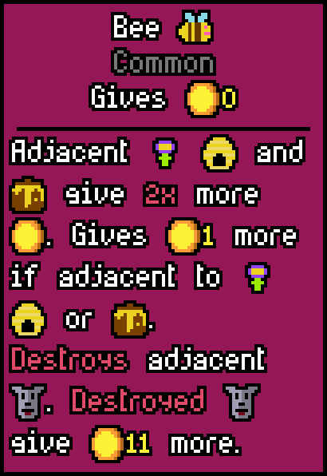

# My Dog Stepped On A Bee

> "Everyone was just having a good time, you know."\
> "My dog stepped on a bee."\
> \- Amber Heard

This is a simple [Luck Be A Landlord](https://youtu.be/GFVskbLPUms?t=48) mod. Install it via the [Steam Workshop](https://steamcommunity.com/app/1404850/workshop/).

## What does the mod do?

It adds the [iconic scene](https://youtu.be/GFVskbLPUms?t=47) from Amber Heard's testimony into the game.

**Dogs can step on bees, get destroyed and give 11 coins more.**

The dogs value on destruction can obviously be increased by adjacent Comedians, Beastmasters, Buffing Capsules, Arrows and the Midas Bomb (if destroyed on the same turn).

Its destruction can be prevented by Dove.

The dog adds a Spirit if you have Shrine.

## How do I contribute?

You can contribute by opening an issue or writing your idea as a comment on the Workshop Page. This includes ideas and translation fixes.

English and German are the only languages that are definately correct. I had to rely on Google Translate for the other ones.